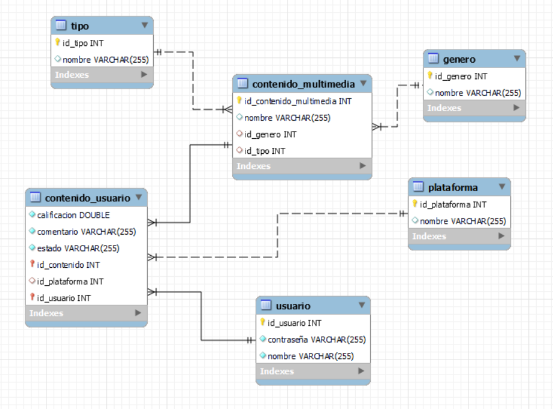

# Filtro Final Spring Boot

El proyecto consiste en realizar un registro de contenido multimedia para los usuarios, en este README se explicara lo que se encuentra en el repositorio.


## Indice

 - [Tecnologias y herramientas usadas](#tecnologias-y-herramientas-usadas)
 - [Base de datos](#base-de-datos)
 - [Uso del proyecto](#uso)
 - [Swagger](#swagger)
 - [Endpoints](#referencia-de-api)
 - [Autor](#autor)

# Tecnologias y herramientas usadas


**JWT** Para la seguridad del pr0grama

**Java** Lenguaje en el que se realizo el programa

**MySQL** Base de datos usada para el proyecto

**Hibernate** Para realizar la conexion de Spring Boot a la base de datos

**Spring Boot** Usado en todo el proyecto para falicitar el trabajo

**Spring Security** Para la seguridad del programa

**Swagger (OpenApi)** Para realizar la documentacion de los Endpoints


# Base de datos

## Diagrama 



## SQL

```SQL

    drop database if exists multimedia;
    CREATE DATABASE  IF NOT EXISTS multimedia;
    USE multimedia;

    CREATE TABLE genero (
    id_genero int NOT NULL AUTO_INCREMENT,
    nombre varchar(255) DEFAULT NULL,
    PRIMARY KEY (id_genero)
    );
    INSERT INTO genero VALUES (1,'Drama');

    CREATE TABLE plataforma (
    id_plataforma int NOT NULL AUTO_INCREMENT,
    nombre varchar(255) DEFAULT NULL,
    PRIMARY KEY (id_plataforma)
    );
    CREATE TABLE tipo (
    id_tipo int NOT NULL AUTO_INCREMENT,
    nombre varchar(255) DEFAULT NULL,
    PRIMARY KEY (id_tipo)
    ); 
    INSERT INTO tipo VALUES (1,'Drama');

    CREATE TABLE usuario (
    id_usuario int NOT NULL AUTO_INCREMENT,
    contraseña varchar(255) NOT NULL,
    nombre varchar(255) NOT NULL,
    PRIMARY KEY (id_usuario),
    UNIQUE KEY UK_cto7dkti4t38iq8r4cqesbd8k (nombre)
    );
    CREATE TABLE contenido_multimedia (
    id_contenido_multimedia int NOT NULL AUTO_INCREMENT,
    nombre varchar(255) DEFAULT NULL,
    id_genero int DEFAULT NULL,
    id_tipo int DEFAULT NULL,
    PRIMARY KEY (id_contenido_multimedia),
    UNIQUE KEY UK_thnhl8mov6cwn6el2kd99fego (id_tipo),
    KEY FKmkdy0ka0nvvxn378ad6anmnii (id_genero),
    CONSTRAINT FK6q7n5tnoh0u2psgd3pep669jx FOREIGN KEY (id_tipo) REFERENCES tipo (id_tipo),
    CONSTRAINT FKmkdy0ka0nvvxn378ad6anmnii FOREIGN KEY (id_genero) REFERENCES genero (id_genero)
    );

    INSERT INTO contenido_multimedia VALUES (1,'Suspenso y drama 2',1,1);

    CREATE TABLE contenido_usuario (
    calificacion double NOT NULL,
    comentario varchar(255) NOT NULL,
    estado varchar(255) NOT NULL,
    id_contenido int NOT NULL,
    id_plataforma int DEFAULT NULL,
    id_usuario int NOT NULL,
    PRIMARY KEY (id_contenido,id_usuario),
    KEY FKmx7lltdd4ti0u3psblcrw56b9 (id_plataforma),
    KEY FKhw4cllq4fjvuapee2xi9889v6 (id_usuario),
    CONSTRAINT FK7esguldr2w95h2q15n83llvqe FOREIGN KEY (id_contenido) REFERENCES contenido_multimedia (id_contenido_multimedia),
    CONSTRAINT FKhw4cllq4fjvuapee2xi9889v6 FOREIGN KEY (id_usuario) REFERENCES usuario (id_usuario),
    CONSTRAINT FKmx7lltdd4ti0u3psblcrw56b9 FOREIGN KEY (id_plataforma) REFERENCES plataforma (id_plataforma));

```

# Uso

Para ejecutar el proyecto

Clona el reposirotio

```bash
  https://github.com/RCNicolas/Examen--final-spring-boot.git
```

En el archivo `application.properties` modificar las siguientes lineas de codigo

```XML
spring.datasource.url=jdbc:mysql://localhost:3306/{BASE DE DATOS}
spring.datasource.username={NOMBRE DE USUARIO}
spring.datasource.password={CONTRASEÑA SI REQUIERE}
```


> [!NOTE]
> Para usar y ejecutar el proyecto de una mejor manera, realmente recomendamos tener instalado un IDE como IntelliJ.

- Primero, clona el repositorio en tu máquina local.

    ```bash
    https://github.com/RCNicolas/Examen--final-spring-boot.git
    ```

- Abre el proyecto en tu IDE.
  

> [!IMPORTANT]
> Antes de ejecutar el proyecto debes haber creado la base de datos, ejecuta el siguiente código [multimediaDB](./multimedia/src/main/resources/multimediaDB.sql) en tu DB MySQL.

- Cambie [application.properties](./fenixgarden/src/main/resources/application.properties) en caso de que haya modificado sus propiedades de MySQL como host, puerto, nombre de usuario o incluso la contraseña.
    En el archivo `application.properties` modificar las siguientes lineas de codigo

    ```XML
    spring.datasource.url=jdbc:mysql://localhost:3306/{BASE DE DATOS}
    spring.datasource.username={NOMBRE DE USUARIO}
    spring.datasource.password={CONTRASEÑA SI REQUIERE}
    ```
- Ahora ejecuta el proyecto, si todo está bien no verás ningún error en la consola de salida.


# Swagger

Para probar el api puedes dirigirte a esta direccion `/doc/swagger-ui.html` una vez alla ejecutado el programa, esta direccion va despues del `localhost` 

Ahí se encontrara toda la informacion de la API REST, donde se podra evidenciar la lo que requiere cada consulta y lo que devuelve


# Referencia de API

## Obtener todos los usuarios

```http
  GET /usuarios
```
### Respuesta 

```json
{
	"id": Integer,
    "nombre": Sring
}
```

## Registrar usuario

```http
  POST /register
```

| Parametros | Tipo     | Descripcion                       |
| :-------- | :------- | :-------------------------------- |
| `user`      | `string` | **Obligatrio** Nombre del usuario |
| `encryptedPass`      | `string` | **Obligatrio** contraseña del usuario |

#### Respuesta 

```json
{
	"message": "Usuario registrado exitosamente"
}
```

### Logear Usuario


```http
  POST /login
```

| Parametros | Tipo     | Descripcion                       |
| :-------- | :------- | :-------------------------------- |
| `user`      | `string` | **Obligatrio** Nombre del usuario |
| `encryptedPass`      | `string` | **Obligatrio** contraseña del usuario |

#### Respuesta 

```json
{
	"token": "Bearer XXXXXXXXXXXXXXXXXXXXXXXXXXXXXXXXXXXXXXXXXX"
}
```

### Listar Tipos de contenido


```http
  GET /tipos
```

#### Respuesta 

```json
{
	"id": 0,
    "nombre": String,
}
```
### Listar Tipos de  por Id


```http
  GET /tipo-by-id/{id}
```
| Parametros | Tipo     | Descripcion                       |
| :-------- | :------- | :-------------------------------- |
| `id`      | `Integer` | **Obligatrio** Id del tipo de contenido que se quiere buscar |

#### Respuesta 

```json
{
	"id": 0,
    "nombre": String,
}
```

### Listar Plataformas


```http
  GET /plataformas
```

#### Respuesta 

```json
{
	"id": 0,
    "nombre": String,
}
```


### Listar Generos


```http
  GET /generos
```

#### Respuesta 

```json
  {
    "id": 0,
    "nombre": "string"
  }
```

### Listar Contenido de Usuarios


```http
  GET /contenido-usuarios
```

#### Respuesta 

```json
{
    "idUsuario": 0,
    "idContenido": 0,
    "idPlataforma": 0,
    "estado": "string",
    "comentario": "string",
    "calificacion": 0
  }
```


### Listar Contenido de Usuarios


```http
  GET /contenido-multimedia
```

#### Respuesta 

```json
	{
    "idContenidoMultimedia": 0,
    "nombre": "string",
    "idGenero": 0,
    "idTipo": 0
  }

```


# Autor

- [@RCNicolas](https://github.com/RCNicolas)